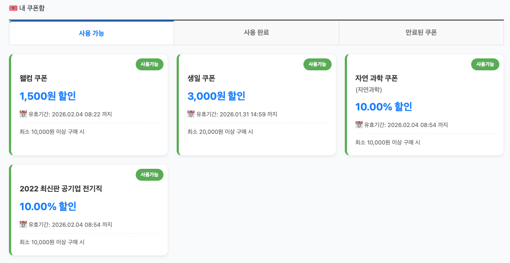
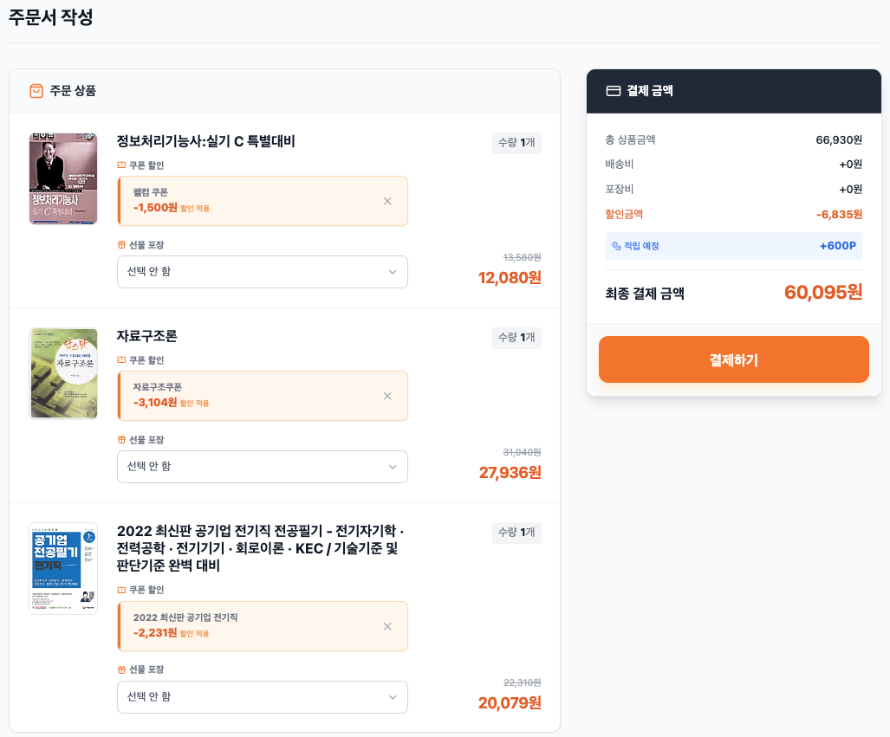

# Coupon Service

도서 쇼핑몰 **MSA 환경**에서  
**쿠폰 정책 관리, 쿠폰 발급, 쿠폰 사용**을 담당하는 마이크로서비스입니다.

본 서비스는 **Spring Cloud 기반 MSA 구조**에서  
Gateway, Eureka, RabbitMQ, Batch Server와 연동되어 동작합니다.

---

## 기술 스택

- Java 21
- Spring Boot
- Spring Data JPA
- Spring Batch
- Spring Cloud Gateway
- Eureka
- RabbitMQ
- MySQL
- Docker / Docker Compose

---
## 화면 구성

[쿠폰 정책 관리 화면]

[마이페이지 내 쿠폰함]

[주문시 쿠폰 적용 화면]

---

## 1. 주요 기능

Coupon Service는 쿠폰의 **정책 정의 → 발급 → 조회 → 사용 처리**까지  
쿠폰 도메인의 전반적인 기능을 담당합니다.

---

### 쿠폰 정책 관리 (관리자)

#### 쿠폰 정책 생성
- **일반 쿠폰**
    - 전체 주문에 적용
- **도서 쿠폰**
    - 특정 도서에만 적용
- **카테고리 쿠폰**
    - 특정 카테고리에 속한 도서에만 적용

#### 할인 방식
- 정액 할인
- 정률 할인

#### 기타 정책 조건
- 최소 주문 금액
- 최대 할인 금액
- 유효 기간
- 발급 수량 제한 (무제한 / 제한)

> 쿠폰 정책은 **발급 이전까지 자유롭게 수정 가능**하며,  
> 발급 이후에는 비즈니스 규칙에 따라 수정/삭제가 제한됩니다.

---

### 쿠폰 정책 조회 / 수정 / 삭제 (관리자)

#### 조회
- 전체 정책 목록 조회
- 단일 정책 상세 조회

#### 수정
- 발급 이력이 없는 정책만 수정 가능
- 이미 발급된 쿠폰이 존재하는 경우
    - 할인 조건 변경 불가
    - 정책 상태(활성/비활성)만 변경 가능

#### 삭제
- 발급 이력이 없는 정책만 삭제 가능
- 발급 이력이 존재하는 경우
    - 데이터 무결성을 위해 삭제 차단
    - 비활성화만 허용

---

### 쿠폰 발급

#### 사용자 쿠폰 다운로드
- 관리자가 생성한 쿠폰 정책을 기반으로
- 사용자가 직접 쿠폰 다운로드

#### Welcome 쿠폰 발급 (비동기)
- 회원 가입 이벤트 발생 시 자동 발급
- RabbitMQ 기반 메시지 큐 사용
- 가입 API와 쿠폰 발급 로직 분리
    - 사용자 응답 지연 방지
    - 서비스 간 결합도 최소화

---

### 쿠폰 조회 (사용자)

마이페이지에서 다음과 같은 쿠폰 조회 기능을 제공합니다.

- 사용 가능한 쿠폰
- 이미 사용한 쿠폰
- 만료된 쿠폰

또한 쿠폰 적용 범위에 따라:
- 특정 도서 쿠폰
- 특정 카테고리 쿠폰

을 구분하여 조회할 수 있습니다.

---

### 쿠폰 사용 / 사용 취소

- 주문 시 쿠폰 사용
- 유효 기간 / 사용 여부 / 적용 대상 검증
- 사용 완료 시 쿠폰 상태 변경
- 주문 취소 시 쿠폰 사용 취소 처리

---

## 2. 배치 기반 쿠폰 발급 설계 (생일 쿠폰)

생일 대상 사용자에게 쿠폰을 **대량 발급**하기 위해  
동일한 요구사항을 두 가지 방식으로 구현했습니다.

---

### 방식 1. Batch Server가 DB에 직접 접근

**사용 기술**
- JdbcPagingItemReader
- JdbcBatchItemWriter

**처리 흐름**
1. Batch Server가 User DB 직접 조회
2. 생일 대상 사용자 페이징
3. Chunk 단위 쿠폰 생성
4. Coupon DB 직접 INSERT

**특징**
- 성능 최우선
- 네트워크 비용 최소
- 서비스 간 DB 의존 존재

---

### 방식 2.메시지 기반 발급 (RabbitMQ)

**사용 기술**
- Feign Client
- Spring Batch
- RabbitMQ
- JDBC Insert

**처리 흐름**
1. Batch Server → User Server Feign 페이징 조회
2. Chunk 단위 발급 데이터 생성
3. RabbitMQ 발행
4. Coupon Server에서 소비 후 저장

**특징**
- 서비스 간 DB 직접 접근 없음
- 느슨한 결합
- 메시지 기반 확장성

---

### 🔁 생일 쿠폰 발급 방식 비교

| 구분 | DB 직접 접근 | 메시지 기반 |
|---|---|---|
| 데이터 조회 | JdbcPagingItemReader | Feign 페이징 API |
| 쿠폰 저장 | JdbcBatchItemWriter | Coupon Server JDBC Insert |
| MSA 경계 | ❌ | ✅ |
| 결합도 | 높음 | 낮음 |
| 성능 | 매우 우수 | 중간 |
| 확장성 | 제한적 | 높음 |
| 운영 복잡도 | 낮음 | 높음 |
| 추천 상황 | 성능 최우선 | MSA 준수, 확장성 중시 |

> 성능이 중요한 환경에서는 DB 직접 접근 방식을,  
> MSA 구조 준수와 확장성이 중요할 경우 메시지 기반 방식을 선택할 수 있도록 설계했습니다.

---

## 3. 테스트 전략

- Controller Test
    - API 응답 및 예외 매핑 검증
- Service Test
    - 비즈니스 규칙(수정/삭제 제한) 검증
- 도메인 규칙 중심 테스트 작성

---

## 마무리

Coupon Service는  
단순 CRUD를 넘어  
**쿠폰 도메인의 복잡한 비즈니스 규칙과  
대량 발급 전략을 비교·선택할 수 있도록 설계된 서비스**입니다.
